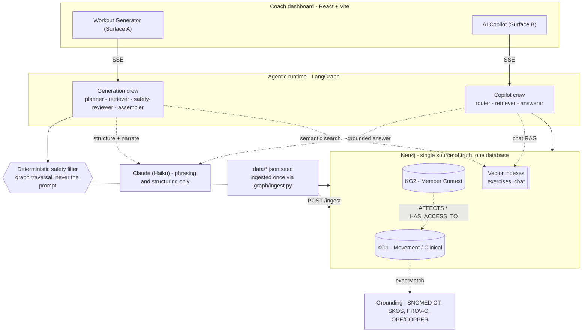

# Future — Knowledge-Graph-Backed Coach Dashboard

A coach-facing dashboard that **generates safe, personalized workouts** and lets a
coach **retrieve member context through an AI copilot** — where every
recommendation is driven by a **knowledge graph, not the language model alone**.
Safety is enforced **deterministically through graph traversal**; the LLM only
resolves language and phrases results. It can answer *"why did you skip barbell
squats for her?"* by pointing at the exact graph path that produced the decision.

> Take-home submission. **Synthetic data only** — no real member or personal data.

---

## Architecture



**Neo4j is the single source of truth.** Every fact the coach sees — exercises,
injuries, adherence, sleep, chat — is read from the graph at request time; the
`data/*.json` files are *seed only*, ingested once via `graph/ingest.py`. The LLM
**phrases** what the graph returns and never originates a fact.

Free text → resolved onto canonical graph concepts (3-pass resolver) → graph
traversal makes the safe, auditable decision → the LLM phrases it. The two graphs
meet at `Injury -[:AFFECTS]-> Joint` and `Member -[:HAS_ACCESS_TO]-> Equipment`,
so member context drives clinical safety.

The vector indexes (exercise semantics · chat history) only **widen retrieval
recall** — they never make the safety call.

### Request/response vs. streaming — when output reaches the client

Two endpoint shapes. The `|SSE|` edges above are **responses**, not inputs: one
POST opens the connection, the server then **pushes a sequence of output frames**
(`event: <name>\ndata: <json>\n\n`) over that held-open connection.

- **Plain request → one JSON blob** (connection responds once, closes):
  `GET /roster`, `GET /members/{id}/chat`, `GET /.../charts/{kind}`, `POST /generate`.
- **SSE stream → many output frames** (`POST /generate/stream`, `POST /copilot`).
  The **graph-derived truth is emitted first**, before the LLM is even called, so
  it is never blocked behind LLM latency; the prose streams after:

  | endpoint | frame 1 (instant) | frame 2 (repeats) | frame 3 |
  |---|---|---|---|
  | `/copilot` | `context` — deterministic facts + intent + trace | `answer` — one per LLM token | `done` |
  | `/generate/stream` | `result` — structured plan **or** a clarification + provenance + trace | `narration` — one per LLM token | `done` |

The client (`api.ts` `postSSE`) reads the body as a stream, splits on the blank-line
frame boundary, and updates React state per frame — which is why the facts/plan snap
in immediately and the sentence then assembles word by word.

---

## Run it (one command)

**Requires Docker with Compose v2** — Docker Desktop, OrbStack, Colima, or a Linux
Docker Engine all work. No local Python/Node/Neo4j needed; everything runs in
containers.

```bash
docker compose up --build        # neo4j + backend + frontend
curl -X POST localhost:8000/ingest    # load the graph (once)
```

- **Dashboard:** http://localhost:5173
- **API / OpenAPI docs:** http://localhost:8000/docs
- **Neo4j browser:** http://localhost:7474 (`neo4j` / `futurepassword`)

The LLM is **optional** — without a key the system still generates safe plans and
grounded answers (deterministic), just without natural-language narration. To
enable Claude, drop a key in `knowledge-graph/.env` (gitignored):

```
ANTHROPIC_API_KEY=sk-ant-...
# CLAUDE_MODEL=claude-haiku-4-5   # default; opus-4-8 / sonnet-4-6 for more polish
```

> First run downloads a ~130 MB ONNX embedding model (cached in a volume after).

**Tests & evaluation:**
```bash
docker compose exec backend pytest                 # 14 critical-path tests
docker compose exec backend python -m evaluation.run   # scored eval report
```

---

## The two surfaces

**A · Workout Generator.** Prompt + time window → a multi-agent runtime renders a
structured workout (warmup / main / cooldown, sets·reps·rest). Interactive,
graph-driven: exclude exercises, account for injuries (via the anatomy
hierarchy), drop unavailable equipment and **find alternatives**. A
**clarify-before-generate** gate catches an avoidance the coach gestures at but
that isn't on file (*"easy on the knee"* for a member with no knee injury) and
asks rather than guessing — a *Yes* filters the safe pool through the same
`part-of` traversal as a real injury. Every plan ships a **provenance trace** (why
each exercise, which graph path, what was filtered for safety) and a
**graph-evidence** visualization.

**B · Coach AI Copilot.** Chat with retrieval over the member-context graph:
quick-prompt palette (*brief · adherence · sleep · churn · what changed*), charts
(adherence / sleep / weight / messages), **past chat history with image
attachments**, and **grounded follow-ups** (conversation memory for context,
every claim still pinned to the retrieved member slice — never invented). Routing
is **deterministic-first** (keyword match answers the common case in ~0ms, no LLM
— a coach wants a fast reminder); only a free-typed question that keywords can't
place escalates to a **structured `RouteDecision`**, and if even that is
low-confidence it **asks an either/or question** rather than guessing.

---

## The two knowledge graphs

- **KG1 · Movement/Clinical** — exercises, muscles, joints/regions, movement
  patterns, equipment, injuries. Edges: `targets`, `loads`, `requires`,
  **`part-of`** (anatomy hierarchy — an injured region cascades to its joints and
  a sub-structure rolls up), **`contraindicated-for`** (injury → unsafe movement
  patterns). Grounded in published ontologies (below).
- **KG2 · Member Context** — profile, goals, injuries, sessions, adherence,
  biomarkers, labs, **embedded chat history**, coach brief — plus **Oura** wearable
  readings, because the profile is source-agnostic (see *Design notes*).

Full node/edge contract: [`docs/SCHEMA.md`](docs/SCHEMA.md).

---

## Tech choices — and why

| Choice | Why |
|--------|-----|
| **Neo4j (labeled property graph)** | Spec-preferred; the safety question *is* a traversal. One DB holds both subgraphs **and** native vector indexes, so GraphRAG's structural + semantic halves live together. |
| **Deterministic safety, LLM-for-phrasing** | The graded promise is safety *from the graph, not the prompt*. The safety-reviewer validates every prescribed id ∈ the graph-derived safe set; the LLM cannot introduce an unsafe exercise (prompt-injection can't move it either). |
| **LangGraph multi-agent crews** | Typed-state `StateGraph`s with explicit edges and a critic loop — the agentic workflow the brief asks for, with safety as a hard gate, not a probabilistic hope. |
| **Claude Haiku (default)** | *Because* reasoning lives in the graph, the LLM only does light structuring + phrasing — the fastest/cheapest tier fits, serving the <5 s and token-efficiency targets. Configurable up to Opus. |
| **fastembed (ONNX bge-small)** | Local embeddings, no PyTorch, no per-lookup API cost — keeps concept resolution and chat retrieval cheap and offline. |
| **3-pass resolver (exact → fuzzy+alias → vector)** | Vectors are a *fallback*, not the backbone — gym jargon ("pecs", "delts") resolves deterministically via SKOS-style altLabels; embeddings handle only the genuinely novel tail. |

More on scale / i18n / security / interoperability and the ontology grounding:
[`docs/DESIGN-NOTES.md`](docs/DESIGN-NOTES.md).

---

## How safety works (the core constraint)

A single Cypher walk decides eligibility — there is no "be careful" in a prompt:

```
(Member)-[:HAS_INJURY]->(Injury)-[:AFFECTS]->(ij:Joint)
(Exercise)-[:LOADS]->(loaded:Joint)
WHERE (loaded)-[:PART_OF*0..]->(ij) OR (ij)-[:PART_OF*0..]->(loaded)   -- part-of
  OR (Injury)-[:CONTRAINDICATES]->(:MovementPattern)<-[:HAS_PATTERN]-(Exercise)
```

plus an equipment-availability check. `part-of` means a knee injury also covers
its sub-structures (and a region injury cascades to its joints); the pattern edge
catches unsafe movements that don't even load the injured joint (e.g.
plyometrics). "Why?" returns the exact path; "alternatives" returns same-pattern
exercises that pass the same filter.

---

## Ontology grounding 

- **SKOS** — gym-jargon altLabels + SNOMED `exactMatch`: the catalog↔ontology bridge.
- **SNOMED CT** (via NCI EVS) — official codes for the 9 joints + patellofemoral
  sub-structure + the seed conditions (knee `49076000`, patellofemoral stress
  syndrome `430725003`), fetched once and **cached offline** (`data/snomed-cache.json`).
- **PROV-O** — provenance of *why each exercise was selected* (Surface A).
- **OPE / COPPER** — node taxonomy aligned to OPE; COPPER realized as the
  longitudinal journey-stage reasoning. *What we left out, and why, is documented.*

---

## Challenges & trade-offs

- **Latency vs. quality.** First cut ran ~37 s on Opus with three serial LLM
  calls. Fix that follows from the architecture: make the planner deterministic
  (the graph resolves concepts), stream narration off the critical path, and —
  since the LLM's job is light — default to **Haiku**. Result: **~3.5 s** warm.
- **Vectors are a trap if they're the backbone.** "Kneeling Lat Stretch" reads
  benign but loads the knee; "Push-Up to **Knee**-Drive" reads risky but doesn't.
  Name/vector similarity gets both backwards; the graph's `joints_loaded` gets
  both right. So embeddings are the 3rd pass, not the 1st.
- **`priority_tier` is constant (2)** across all 50 exercises — documented as a
  non-signal rather than faked into a ranking.
- **Interactive ad-hoc constraints** (a one-off "her knee is bothering her" for a
  member without it stored) currently flow through `exclude_terms`; richer ad-hoc
  injury/equipment overrides are the next increment.

---

## How I used AI to build this

Built with Claude (Claude Code). AI was used to: scaffold the FastAPI/Neo4j and
React structure, write Cypher and the LangGraph crews, generate the synthetic
Dune-themed members, and draft docs — all under tight human direction on
architecture (graph-owns-safety, deterministic resolver, model/latency choices).
The Claude integration itself follows current best practice (prompt caching,
structured outputs, streaming, graceful degradation). Decisions, trade-offs, and
the safety invariant were human-reviewed and verified by the test + eval suites.

---

## Evaluating this in production

- **Safety (non-negotiable):** the invariant *no contraindicated exercise is ever
  eligible* is asserted per member in CI (`evaluation/run.py`) and as a unit test;
  in production it becomes a **blocking guardrail** on every generated plan
  (validate ids ⊆ safe set before returning) with alerting on any violation.
- **Retrieval quality:** labeled concept-resolution accuracy and top-k relevance,
  tracked over time; alert on regressions when the catalog or model changes.
- **Recommendation quality:** coach accept/edit rate, equipment/time-budget
  compliance, member adherence as a downstream signal.
- **Failure modes to monitor:** empty/thin safe pools (over-constrained members →
  graceful degradation path), resolver low-confidence rate (→ ask-for-clarification),
  LLM latency/cost (`usage`, cache-hit rate), graph-query latency, model drift.
- **Observability:** every generation already emits a per-agent/tool/query trace
  (timings) — the basis for production tracing (LLM calls, tools, Cypher).

---

## Worked examples

**1 · Injury + limited equipment — Jordan Rivera** (recovering left knee, no barbell):
`"build lower-body strength without aggravating my knee"`
- **Plan** (at-risk → low volume): warmup *Walking Toe Touches, Standing Neck
  Circles*; main *Low-Plank↔Side-Plank, Bodyweight Pike, **Push-Up to Knee-Drive**,
  DB Overhead Press*; cooldown stretches.
- **Filtered for safety:** *Barbell Racked Forward Lunge* (joint + equipment),
  *BOSU Step Over* (joint + pattern) → alternatives *Bodyweight Pike, Plank*.
- **Invariant:** 0 of the prescribed ids are contraindicated; none need a barbell.

**2 · Over-constrained / graceful degradation — Alia Atreides** (knee + shoulder +
lumbar injuries, only a yoga mat + band): the safe pool collapses to **3** — the
system returns a coherent gentle plan rather than crashing or inventing.

**3 · Copilot grounding — Duncan Idaho:** *"How did he sleep this week?"* →
*"avg sleep score 82, 6.9–8.0 h, best May 31 (88), lowest June 2 (76)"* — drawn
straight from his Oura readings in KG2, nothing invented.

---

## Project layout

```
backend/   FastAPI · Neo4j driver · graph/ (KG1+KG2 ingest, anatomy, schema)
           resolver · safety · longitudinal · grounding/ (SNOMED) · agents/ (crews)
           llm · observability · tests/ · evaluation/
frontend/  React + Vite editorial dashboard (both surfaces, graph-viz, charts)
data/      exercises.json · member-context.json (Jordan) · members-extra.json
           snomed-cache.json
docs/      SCHEMA.md · DESIGN-NOTES.md
```

Status: KG1+KG2 · deterministic safety · 3-pass resolution · two LangGraph crews ·
streaming · provenance · ontology grounding · longitudinal/Oura · graph-viz ·
charts · clarify-before-generate · confidence-gated copilot routing · chat history
+ images · grounded follow-ups · input-size guards · tests (14) · eval ·
one-command Docker. Synthetic data only.

---

## Where this goes next

Three threads I'd build under the same graph-owns-the-reasoning principle — noted
here as direction, not solved:

- **Clinician-in-the-loop governance for contraindication edges.** Today the
  `CONTRAINDICATES` rules are a hand-rolled starter map. In production they need
  an owner: who signs a rule, how it's versioned, and how a change is reviewed
  before it filters a real member's plan. The edges become governed clinical
  artifacts with provenance, not code constants.
- **The labs→condition→prescription path, end-to-end.** The lab layer already
  surfaces flagged markers; the next step is to traverse from a lab finding to the
  condition it implies to the training/lifestyle prescription it warrants — the
  same deterministic, explainable graph path, extended through the clinical middle.
- **A medication / dose-phase model.** For GLP-1 and similar, where the member is
  in their titration changes what's safe and what's appropriate to prescribe.
  Modeling medication and dose phase as first-class nodes lets the graph reason
  over it the way it already reasons over injuries and equipment.
