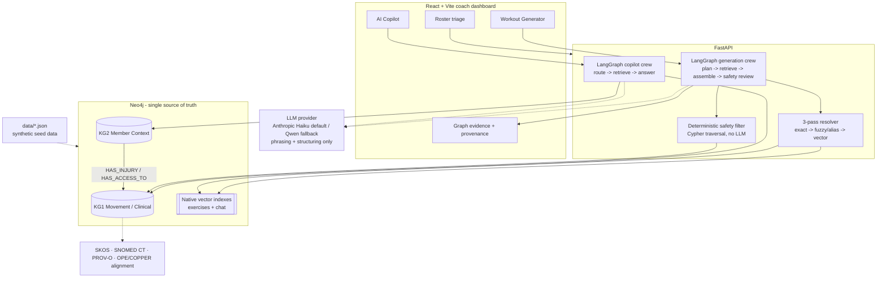

# Future - Knowledge-Graph-Backed Coach Dashboard

A coach-facing dashboard that generates safe, personalized workouts and lets a
coach retrieve member context through an AI copilot.

The core design choice: **the graph owns the reasoning; the LLM owns language.**
Free text is resolved onto canonical graph concepts, Neo4j traversals decide what
is safe or relevant, and the LLM phrases the already-grounded result.

> Take-home submission. Synthetic data only; no real member or personal data.

---

## What To Try

1. Open the dashboard and select **Jordan Rivera**.
2. Generate: `Lower-body strength, protect the knee, no barbell, only dumbbells and a kettlebell, exclude deadlifts`.
3. Open **Why these?**, **Filtered out**, and **Graph evidence**.
4. Open the copilot and ask **Show me the brief**, **How's adherence trending?**,
   or **How did they sleep this week?**

This path shows the main rubric items in one place: concept resolution,
injury/equipment traversal, provenance, member-context retrieval, charts, and
coach-facing product flow.

---

## Architecture



**Neo4j is the source of truth.** Exercises, injuries, equipment, sleep,
adherence, chat, labs, and provenance are read from the graph at request time.
The JSON files in `data/` are seeds, not runtime truth.

**Vectors are a fallback.** They improve recall for messy language and chat
retrieval, but they never decide safety.

---

## Run It

Requires Docker with Compose v2. No local Python, Node, or Neo4j install is
needed.

```bash
docker compose up --build
```

That one command starts Neo4j, the FastAPI backend, and the Vite frontend. On
first boot, the backend warms the embedding model and seeds Neo4j automatically
from `data/*.json`. The first run can take a few minutes because Docker installs
dependencies and downloads the ONNX embedding model.

- Dashboard: http://localhost:5173
- API docs: http://localhost:8000/docs
- Neo4j Browser: http://localhost:7474 (`neo4j` / `futurepassword`)

If the dashboard opens before seeding finishes, wait for the backend to print
`Application startup complete` and refresh. If you edited seed data and want to
force a re-ingest:

```bash
curl -X POST localhost:8000/ingest
```

No `.env` file is required for the core demo. Without an LLM key, graph-safe
plans, provenance, filtered exercises, charts, and retrieved copilot context
still work; only streamed narration/LLM-routed phrasing is omitted.

```env
LLM_PROVIDER=anthropic
ANTHROPIC_API_KEY=sk-ant-...
CLAUDE_MODEL=claude-haiku-4-5
```

Venice/Qwen is available as an explicit OpenAI-compatible fallback:

```env
LLM_PROVIDER=venice
VENICE_API_KEY=...
LLM_BASE_URL=https://api.venice.ai/api/v1
MODEL_INTENT=qwen3-next-80b
MODEL_NARRATE=qwen3-next-80b
MODEL_COPILOT=qwen3-next-80b
```


---

## The Product

**Surface A - Workout Generator**

The coach enters a prompt and time window. The runtime resolves concepts,
retrieves the graph-safe candidate pool, assembles warmup/main/cooldown, validates
every exercise ID against the safe set, and returns provenance.

Interactive constraints are graph-driven:

| Coach says | Behavior |
| --- | --- |
| `Exclude deadlifts` | Deadlift name variants are removed from eligibility. |
| `Her left knee is bothering her` | Knee is resolved to the joint graph; part-of traversal covers substructures. |
| `No barbell, only dumbbells and a kettlebell` | Barbell-only work is filtered; safe alternatives are shown. |

The UI then lets the coach reorder, remove, add only from the safe pool, add cues,
and send the final plan.

**Surface B - Coach AI Copilot**

The copilot retrieves over KG2: profile, goals, injuries, adherence, sleep,
Oura-style wearable readings, labs, DEXA, workout history, chat, coach brief, and
churn signals. Quantitative answers come from typed graph slices and chart
endpoints; the LLM phrases the answer and cites the retrieved facts.

---

## The Two Knowledge Graphs

**KG1 - Movement / Clinical**

Nodes: `Exercise`, `Muscle`, `Joint`, `Region`, `MovementPattern`, `Equipment`,
`Injury`.

Edges: `TARGETS`, `LOADS`, `REQUIRES`, `HAS_PATTERN`, `PART_OF`,
`CONTRAINDICATES`.

This graph answers: What does an exercise train? What does it load? What
equipment does it require? Which movements are unsafe for an injury?

**KG2 - Member Context**

Nodes: `Member`, `Goal`, `Session`, `AdherenceWeek`, `OuraReading`, `Lab`,
`ChatMessage`, `CoachBrief`, `MorningTask`, plus member-linked injuries and
equipment.

Bridge edges connect member facts into KG1:

- `Member -[:HAS_INJURY]-> Injury -[:AFFECTS]-> Joint`
- `Member -[:HAS_ACCESS_TO]-> Equipment`

Full schema: [`docs/SCHEMA.md`](docs/SCHEMA.md).

---

## Safety

Safety is a Cypher traversal, not a prompt instruction:

```cypher
(Member)-[:HAS_INJURY]->(Injury)-[:AFFECTS]->(ij:Joint)
(Exercise)-[:LOADS]->(loaded:Joint)
WHERE (loaded)-[:PART_OF*0..]->(ij)
   OR (ij)-[:PART_OF*0..]->(loaded)
   OR (Injury)-[:CONTRAINDICATES]->(:MovementPattern)<-[:HAS_PATTERN]-(Exercise)
```

Then equipment feasibility is checked against `HAS_ACCESS_TO` plus any
session-specific equipment overrides.

Every generated plan is safety-reviewed after assembly: prescribed IDs must be a
subset of the graph-derived safe pool. The coach can manually edit the plan, but
the add-picker is also restricted to that same safe pool.

---

## Ontology Grounding

The grounding is intentionally small and load-bearing.

| Source | Used for | Left out |
| --- | --- | --- |
| SKOS | `altLabel`-style gym jargon (`pecs`, `delts`) and exact/alias concept mappings. | Full RDF machinery. |
| SNOMED CT via NCI EVS | Official codes for the 9 joints, patellofemoral substructure, and seed conditions. Cached in `data/snomed-cache.json`. | Full SNOMED hierarchy and laterality variants. |
| PROV-O | Recommendation provenance: chosen exercise, graph path, filtered candidate, safety reason. | JSON-LD/RDF export. |
| OPE | Exercise-domain class alignment: exercises, muscles, joints, equipment, injuries. | Full OWL ingest. |
| COPPER | Personalization/journey-stage framing from adherence and churn. | Lifestyle ontology classes outside this catalog's granularity. |

More: [`docs/DESIGN-NOTES.md`](docs/DESIGN-NOTES.md).

---

## Tests And Evaluation

```bash
docker compose exec backend python -m pytest
docker compose exec backend python -m evaluation.run
docker compose exec frontend npx tsc -b --pretty false
```

Current coverage focuses on the critical paths:

- Resolver: exact, alias/fuzzy, vector fallback, abstention.
- Safety: eligible set disjoint from contraindicated set, part-of traversal,
  pattern contraindications, equipment feasibility, safe alternatives.
- Interactive adjustment: deadlift exclusion, equipment polarity, clarify gates,
  requested-but-filtered acknowledgement.
- LLM provider facade: no-key degradation, active-provider key selection,
  structured output, streaming deltas, and token accounting.
- Fixture-backed demo cases:
  [`backend/tests/fixtures/worked_examples.json`](backend/tests/fixtures/worked_examples.json)
  executed by
  [`backend/tests/test_worked_examples.py`](backend/tests/test_worked_examples.py).
- Reader-visible captures:
  [`docs/examples/worked-examples.json`](docs/examples/worked-examples.json)
  contains the generated plans, filtered candidates, audit trace, and provenance.
  It is checked by pytest; refresh it with
  `docker compose exec backend python -m evaluation.worked_examples --write`.
- Evaluation harness: resolver accuracy, retrieval relevance, safety invariant,
  recommendation safe-set membership across synthetic members.

---

## Key Decisions

| Decision | Why |
| --- | --- |
| Neo4j over in-memory graph | The spec asks whether graph traversal is doing real work. Neo4j gives a production-shaped graph store, Cypher, constraints, and native vector indexes. |
| LangGraph runtime | The workflow has explicit stages and a safety reviewer loop; safety is a hard gate, not a model preference. |
| Claude Haiku default | The graph does the reasoning, so the LLM can be fast and cheap: structure light outputs, phrase grounded answers, stream narration. |
| fastembed local embeddings | No per-lookup API cost; useful for fallback concept resolution and chat retrieval. |
| Source-agnostic member graph | Oura, labs, DEXA, adherence, and chat all become graph facts. Members are not penalized for bringing data from outside Future. |
| Graceful no-key mode | The deterministic core runs without an LLM key; a missing model cannot disable safety. |

---

## Trade-Offs

- **Hard exclusion vs. down-ranking.** This implementation hard-excludes
  exercises that load an injured joint. A production refinement could keep
  non-contraindicated joint stress as a down-ranked option, but the conservative
  choice is easier to defend for a safety-critical take-home.
- **Hand-written frontend types.** Backend contracts are Pydantic and OpenAPI
  exposed, but the frontend uses hand-written TypeScript shapes in places. The
  next hardening step is generated TS from the API contract.
- **Catalog scale vs. member scale.** The exercise catalog is finite and
  indexable. The real production load is members, member history, chat embeddings,
  and LLM throughput; see `docs/DESIGN-NOTES.md`.
- **Ontology subset.** The graph uses the ontology pieces that affect reasoning
  instead of ingesting large ontologies shallowly.

---

## Production Evaluation

- **Safety false negatives:** no contraindicated exercise may reach a plan.
  Treat any violation as a blocking release failure.
- **Resolution quality:** track exact/fuzzy/vector/abstain rates and labeled
  accuracy for messy coach language.
- **Retrieval quality:** measure copilot answer grounding and chat retrieval
  precision@k.
- **Recommendation quality:** coach accept/edit rate, substitution acceptance,
  equipment/time compliance, and downstream member adherence.
- **Operational health:** graph-query latency, LLM latency/cost, prompt-cache hit
  rate, token budget exhaustion, and low-confidence clarification rate.

---

## Project Layout

```text
backend/   FastAPI, Neo4j driver, resolver, safety, longitudinal logic,
           LangGraph agents, grounding, tests, evaluation
frontend/  React/Vite dashboard, generator, copilot, charts, graph evidence
data/      Synthetic exercises, Jordan member context, extra synthetic members,
           SNOMED cache
docs/      Schema and design notes
```

Status: KG1 + KG2, deterministic safety, 3-pass resolution, Neo4j vector indexes,
LangGraph generation and copilot crews, SSE streaming, provenance, graph
evidence, charts, source-agnostic member context, fixture-backed demo tests,
tests, and one-command Docker.

AI usage disclosure: [`AI_USAGE.md`](AI_USAGE.md).
